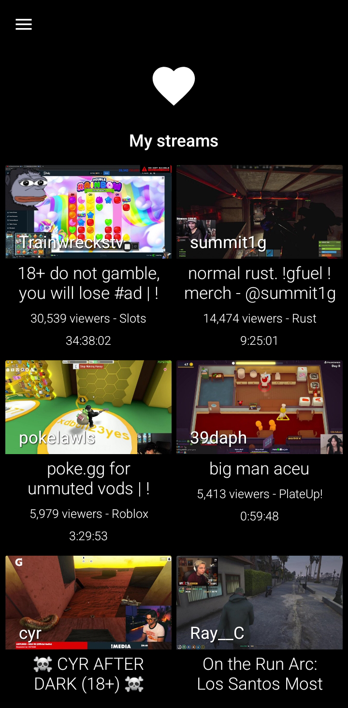
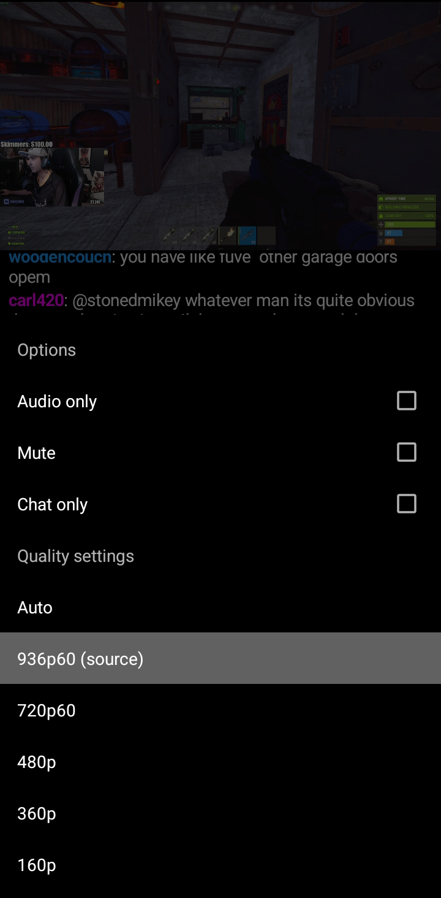
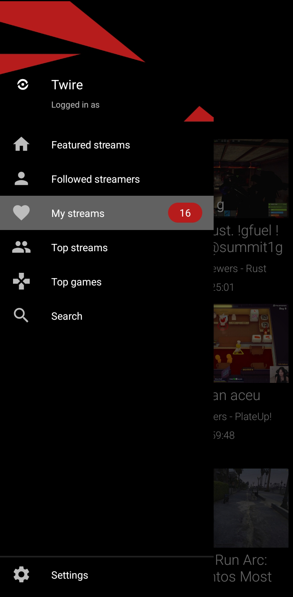

<h1> Twire</h1>

[](https://github.com/twireapp/Twire/releases/)
[](https://hosted.weblate.org/engage/twire/)


Twire is an open source, ad-free Twitch browser and stream player for Android.

This is a fork of the [Pocket Plays for Twitch](https://github.com/SebastianRask/Pocket-Plays-for-Twitch) Android application. You can find more information [in this issue](https://github.com/SebastianRask/Pocket-Plays-for-Twitch/issues/1).

[](https://f-droid.org/packages/com.perflyst.twire/)

## Current features

- Built-in adblock
- VODs with chat replay
- Custom emotes (BTTV, FFZ and 7TV)
- Picture in Picture mode
- Highly customizable UI
- Twitch account support

## Screenshots

[](fastlane/metadata/android/en-US/images/phoneScreenshots/1_my_streams.png)
[](fastlane/metadata/android/en-US/images/phoneScreenshots/2_player.png)
[](fastlane/metadata/android/en-US/images/phoneScreenshots/3_player_settings.png)
[](fastlane/metadata/android/en-US/images/phoneScreenshots/4_navigation.png)

*previews taken with True Night theme enabled*


## Making contributions

Developers are welcome to contribute to the project.

The easiest way to contribute is by reporting issues. The other way involves making pull requests, which requires you to have a proper IDE installed (such as [Visual Studio Code](https://code.visualstudio.com/)) and a copy of the repository.

To clone the repository, run the following commands:
```
git clone https://github.com/twireapp/Twire
cd Twire
```
If you ever need to update your copy to the latest version, run:
```
git pull
```
If you'd like to learn more about making a pull request, please read [this GitHub article](https://docs.github.com/en/pull-requests/collaborating-with-pull-requests/proposing-changes-to-your-work-with-pull-requests/creating-a-pull-request).

### Translations

Translators can help translate Twire over on [Weblate](https://hosted.weblate.org/engage/twire/).

## Licensing

Twire is licensed under the [GNU v3 Public License.](https://github.com/Perflyst/Twire/blob/master/LICENSE)

As this is a fork under GNUv3, other developers were involved.
Copyright notice for: [SebastianRask](https://github.com/SebastianRask), [alexzorin](https://github.com/alexzorin)